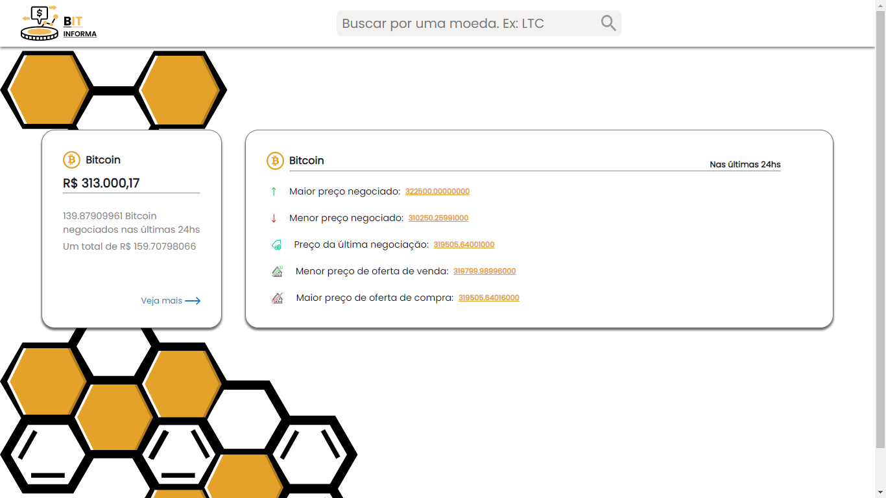

## :memo: About
Landing page where updated data is displayed in real time on most popular cryptocurrencies.

## :computer: Technologies used

:pushpin: HTML

:pushpin: Styled Components

:pushpin: JavaScript

:pushpin: Context API

:pushpin: React

## :zap: How to use?
:one: Clone project on your machine

:two: Open project with [VSCode](https://code.visualstudio.com/download)

:three: Open VSCode terminal and type npm install -y or yarn install -y

:four: Type npm start or yarn start

## :heavy_check_mark: Screenshot 1

    

